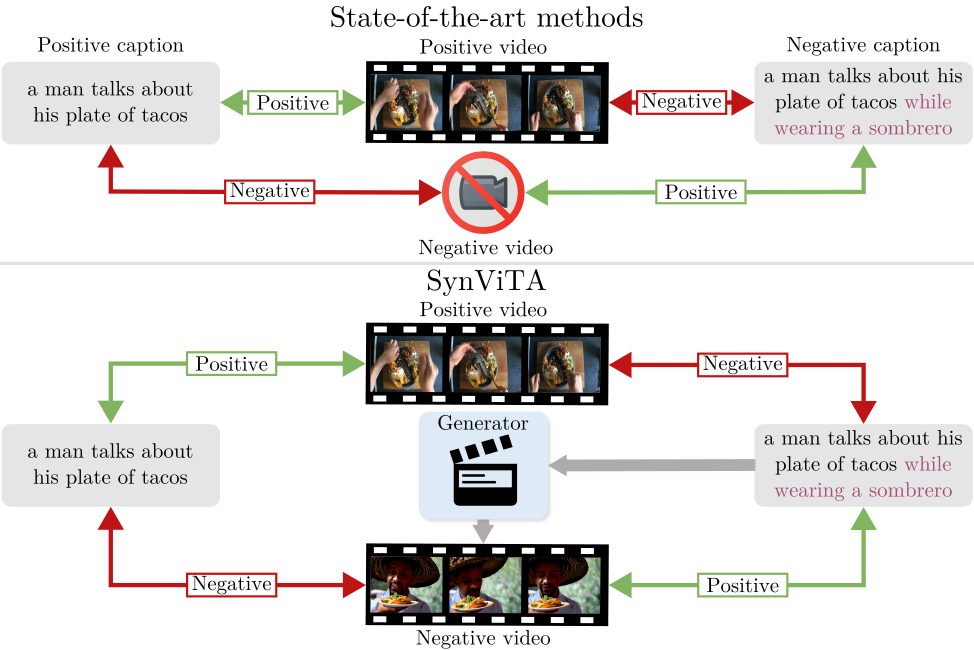

# Can Text-to-Video Generation help Video-Language Alignment?

[Luca Zanella](https://lucazanella.github.io/), [Massimiliano Mancini](https://mancinimassimiliano.github.io/), [Willi Menapace](https://www.willimenapace.com/), [
Sergey Tulyakov](https://stulyakov.com/), [Yiming Wang](https://www.yimingwang.it/), [Elisa Ricci](https://eliricci.eu/)  

  

 

> **Abstract:** *Recent video-language alignment models are trained on sets of videos, each with an associated positive caption and a negative caption generated by large language models.
> A problem with this procedure is that negative captions may introduce linguistic biases, i.e., concepts are seen only as negatives and never associated with a video. While a solution would be to collect videos for the negative captions, existing databases lack the fine-grained variations needed to cover all possible negatives. In this work, we study whether synthetic videos can help to overcome this issue. Our preliminary analysis with multiple generators shows that, while promising on some tasks, synthetic videos harm the performance of the model on others. We hypothesize this issue is linked to noise (semantic and visual) in the generated videos and develop a method, SynViTA, that accounts for those. SynViTA dynamically weights the contribution of each synthetic video based on how similar its target caption is w.r.t. the real counterpart. Moreover, a semantic consistency loss makes the model focus on fine-grained differences across captions, rather than differences in video appearance.
> Experiments show that, on average, SynViTA improves over existing methods on VideoCon test sets and SSv2-Temporal, SSv2-Events, and ATP-Hard benchmarks, being a first promising step for using synthetic videos when learning video-language models.*

# README coming soon!
