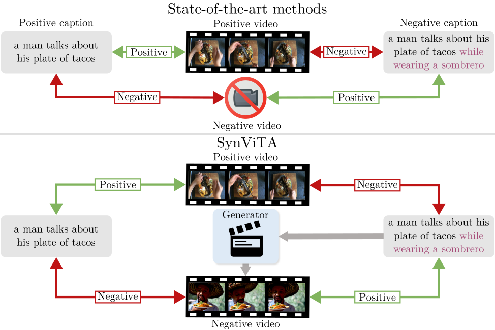

<div align="center">

<h2>CVPR 2025<br>Can Text-to-Video Generation help Video-Language Alignment?</h2>
<!-- # Can Text-to-Video Generation help Video-Language Alignment? -->

[Luca Zanella](https://lucazanella.github.io/), [Massimiliano Mancini](https://mancinimassimiliano.github.io/), [Willi Menapace](https://www.willimenapace.com/), [
Sergey Tulyakov](https://stulyakov.com/), [Yiming Wang](https://www.yimingwang.it/), [Elisa Ricci](https://eliricci.eu/) <br>

[](https://openaccess.thecvf.com/content/CVPR2025/papers/Zanella_Can_Text-to-Video_Generation_help_Video-Language_Alignment_CVPR_2025_paper.pdf)
[](https://lucazanella.github.io/synvita/)

<!-- [](https://huggingface.co/datasets/lucazanella/videocon_syn) -->

</div>

<p align="center">
  
</p>
<br>

> **Abstract:** *Recent video-language alignment models are trained on sets of videos, each with an associated positive caption and a negative caption generated by large language models.
> A problem with this procedure is that negative captions may introduce linguistic biases, i.e., concepts are seen only as negatives and never associated with a video. While a solution would be to collect videos for the negative captions, existing databases lack the fine-grained variations needed to cover all possible negatives. In this work, we study whether synthetic videos can help to overcome this issue. Our preliminary analysis with multiple generators shows that, while promising on some tasks, synthetic videos harm the performance of the model on others. We hypothesize this issue is linked to noise (semantic and visual) in the generated videos and develop a method, SynViTA, that accounts for those. SynViTA dynamically weights the contribution of each synthetic video based on how similar its target caption is w.r.t. the real counterpart. Moreover, a semantic consistency loss makes the model focus on fine-grained differences across captions, rather than differences in video appearance.
> Experiments show that, on average, SynViTA improves over existing methods on VideoCon test sets and SSv2-Temporal, SSv2-Events, and ATP-Hard benchmarks, being a first promising step for using synthetic videos when learning video-language models.*

# Installation

We recommend using a Linux machine with CUDA-compatible GPUs. We used 4 NVIDIA A100 GPUs with 64GB for training and 1 NVIDIA A100 GPU for testing. We provide a virtual environment for each of the two large multimodal models (i.e., mPLUG-Owl and Video-LLaVA) used in our work to configure the required libraries. The code was tested with Python 3.10.8.

Clone the repo with:

```bash
git clone https://github.com/lucazanella/synvita.git
cd synvita
PROJECT_ROOT=$(pwd)
```

## Virtual environment

### mPLUG-Owl

The environment can be installed and activated with:

```bash
python3 -m venv mplugowl
source mplugowl/bin/activate
cd lmms/mPLUG_Owl
pip install -r requirements.txt
cd "${PROJECT_ROOT}"
```

### Video-LLaVA

The environment can be installed and activated with:

```bash
python3 -m venv videollava
source videollava/bin/activate
cd lmms/Video_LLaVA/
pip install --upgrade pip
pip install -e .
pip install -e ".[train]"
pip install flash-attn==2.5.8 --no-build-isolation
pip install decord opencv-python git+https://github.com/facebookresearch/pytorchvideo.git@28fe037d212663c6a24f373b94cc5d478c8c1a1d numpy==1.26.4 pylcs rootutils tqdm
cd "${PROJECT_ROOT}"
```

## Pretrained checkpoints

Our fine-tuned [mPLUG-Owl](lucazanella/mplug-owl-llama-7b-video-lora_train_llm_mix_entail_feedback_cogvideox) and [Video-LLaVA](lucazanella/videollava-7b-lora_train_llm_mix_entail_feedback_cogvideox) models are available on Hugging Face.

## Datasets

We train SynViTA on the VideoCon dataset, which includes video-text triplets from MSR-VTT, VATEX, and TEMPO, as well as synthetic videos generated for each negative caption using CogVideoX, LaVie, and VideoCrafter2. The generated videos are available on [Hugging Face](https://huggingface.co/datasets/lucazanella/videocon_syn).

For evaluation, we use the VideoCon video-language entailment test sets:
(i) VideoCon (LLM): 27K video-text pairs from the same source datasets,
(ii) VideoCon (Human): 570 pairs from ActivityNet,
(iii) VideoCon (Human-Hard): a subset of 290 temporally challenging instances.

We also evaluate on downstream tasks:
(i) text-to-video retrieval (SSv2-Temporal and SSv2-Events),
(ii) video question answering (ATP-Hard).

Please follow the instructions in the [VideoCon](https://github.com/Hritikbansal/videocon) repository to download the datasets.

## Training

We provide Slurm scripts to train both baseline models (on VideoCon) and SynViTA models (on VideoCon with synthetic videos).

| Model                  | Script                                        |
| ---------------------- | --------------------------------------------- |
| VideoCon (Video-LLaVA) | `slurm/Video_LLaVA/finetune_lora_videocon.sh` |
| SynViTA (mPLUG-Owl 7B) | `slurm/mPLUG_Owl/train_synvita.sh`            |
| SynViTA (Video-LLaVA)  | `slurm/Video_LLaVA/finetune_lora_synvita.sh`  |

## Evaluation

We provide Slurm scripts to evaluate both off-the-shelf and fine-tuned models across all datasets. Scripts are located in `slurm/mPLUG_Owl/` for **mPLUG-Owl 7B** and in `slurm/Video_LLaVA/` for **Video-LLaVA**.

| Dataset          | Model         | Script                                                 |
| ---------------- | ------------- | ------------------------------------------------------ |
| VideoCon (LLM)   | SynViTA       | `entailment_inference_videocon_llm.sh`                 |
|                  | Off-the-shelf | `off_the_shelf/entailment_inference_videocon_llm.sh`   |
| VideoCon (Human) | SynViTA       | `entailment_inference_videocon_human.sh`               |
|                  | Off-the-shelf | `off_the_shelf/entailment_inference_videocon_human.sh` |
| SSv2-Events      | SynViTA       | `entailment_inference_ssv2_events.sh`                  |
|                  | Off-the-shelf | `off_the_shelf/entailment_inference_ssv2_events.sh`    |
| SSv2-Temporal    | SynViTA       | `entailment_inference_ssv2_temporal.sh`                |
|                  | Off-the-shelf | `off_the_shelf/entailment_inference_ssv2_temporal.sh`  |
| ATP-Hard         | SynViTA       | `entailment_inference_atphard.sh`                      |
|                  | Off-the-shelf | `off_the_shelf/entailment_inference_atphard.sh`        |

# Acknowledgements

This repository builds upon [VideoCon](https://github.com/Hritikbansal/videocon), [mPLUG-Owl](https://github.com/X-PLUG/mPLUG-Owl), and [Video-LLaVA](https://github.com/PKU-YuanGroup/Video-LLaVA) projects. Huge thanks to the authors!

# Citation

Please consider citing our paper in your publications if the project helps your research.

```
@inproceedings{zanella2025can,
  title={Can Text-to-Video Generation help Video-Language Alignment?},
  author={Zanella, Luca and Mancini, Massimiliano and Menapace, Willi and Tulyakov, Sergey and Wang, Yiming and Ricci, Elisa},
  booktitle={Proceedings of the Computer Vision and Pattern Recognition Conference},
  pages={24097--24107},
  year={2025}
}
```
